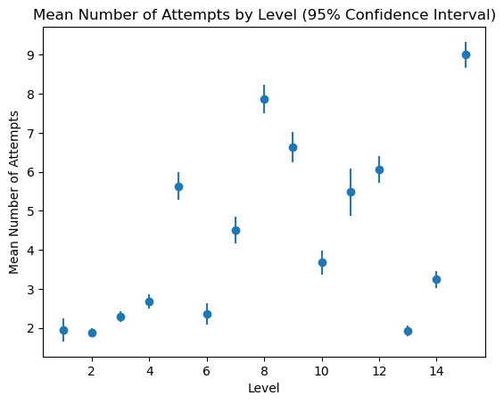
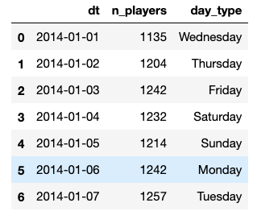

# Candy Crush Saga [WIP]
Analysis of Candycrush dataset from Kaggle

EDA the data set
Computing level difficulty
Plotting difficulty profile
Spotting hard levels
Computing uncertainty
Top earier and difficcult levels
    Should our level designer worry?
Metric of users per day

