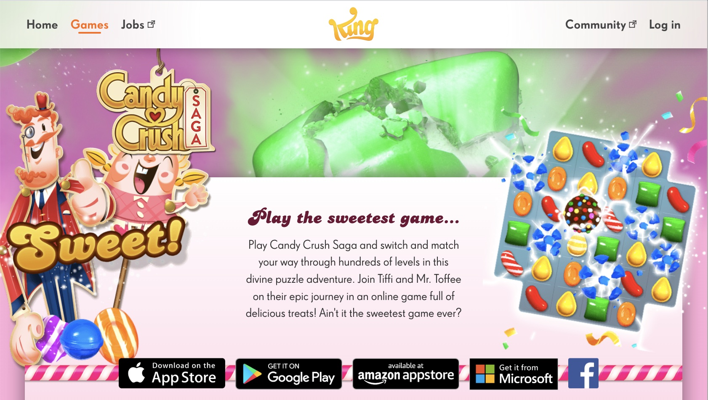
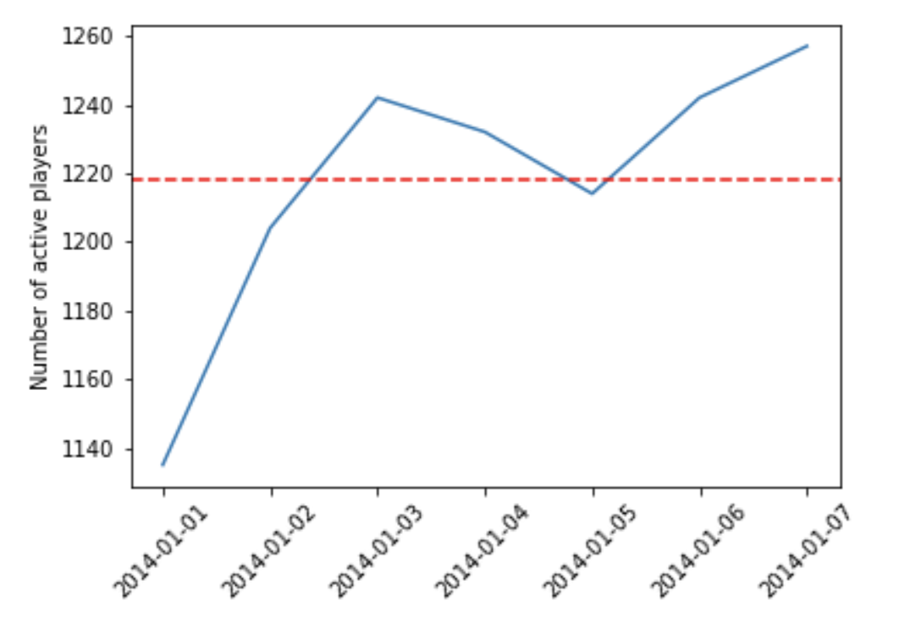
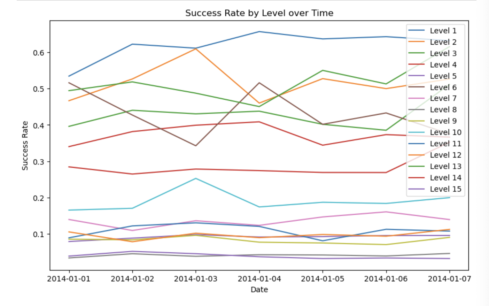
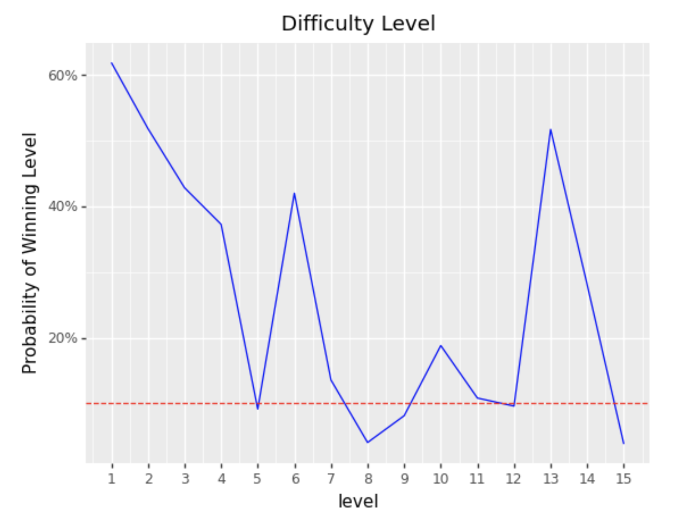
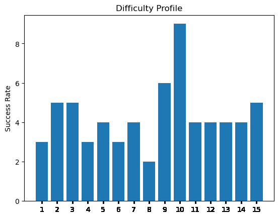

# Candy Crush Saga [WIP]
Analysis of Candycrush dataset from Kaggle

### Daily active users (DAU)
DAU is given by the number of unique users who play the game each day. This metric measures the number of unique users who engage with a game on a daily basis. It is used to track the popularity of a game and to monitor changes in user engagement over time.

- The total avg of players in weekends is 1218.

- The avg of players in weekends is 1223.0
- The avg of players in workdays is 489.2
- The pct of players in weekends over workdays is 2.5

The average number of players in weekends is significantly higher than on workdays, with an average of 1223.0 players compared to 489.2 players, respectively. This suggests that weekends are a popular time for players to engage with the game and spend more time playing and this ie expected.

### Level completion rate
The level completion rate id given by the percentage of players who successfully complete each level of the game. This metric can help to measure the difficulty of the game and identify levels that may need to be adjusted to improve the player experience.

To improve the level balance in the game, we may want to analyze player behavior and performance on each level to identify potential areas for improvement. This could involve gathering more data on player progression through the levels, such as the number of attempts it takes to complete each level and the success rates for each level.

Based on this analysis, we may want to consider adjusting the difficulty of the levels that are currently unbalanced, such as level 8 and level 15. This could involve making these levels slightly easier or more challenging, depending on player feedback and performance data. We may also want to consider introducing new levels or modifying existing levels to provide players with a more engaging and balanced game experience.

Additionally, we may want to consider providing players with more incentives to progress through the levels, such as rewards for completing certain milestones or achievements. This can help to encourage players to continue playing the game and to engage more deeply with the content.

Overall, the best approach to improving level balance in the game will depend on the specific goals and objectives of the game and the preferences of your target audience. It may be helpful to gather feedback from players and conduct user testing to determine which approach is most effective in improving the overall balance and engagement of the game.

#### Is this unbalance cousing churn?
The number of players in the next levels is significant. Apparently this doesn't seem to be a bottleneck causing players to leave.

### Number of attempts per level

To improve the level reliability and consistency in the game, we may want to investigate why the uncertainty for level 11 is higher compared to the other levels. This could involve analyzing player behavior and performance on the level, identifying potential bugs or glitches, or adjusting the level design to better balance the difficulty and provide a more consistent experience for players.

Additionally, to improve the reliability of the data for all levels, we may want to consider implementing a more robust data tracking system that captures more accurate and precise metrics for player behavior and performance. This can help to reduce the uncertainty and improve the overall reliability of the data, making it easier to analyze and make informed decisions about level design and game balance.

We may also want to consider providing players with more opportunities to provide feedback and suggestions for improvement. This can help to identify areas where players are experiencing difficulty or frustration and provide valuable insights for improving the overall game experience.

Overall, the best approach to improving the reliability and consistency of the levels will depend on the specific goals and objectives of the game and the preferences of its target audience. It may be helpful to conduct regular updates and adjustments to the game based on player feedback and performance data, as well as to analyze player behavior and performance on the different levels to identify potential areas for improvement.

### Success rate over time

To improve the success rate and overall consistency of the game, we may want to investigate why the success rate in level 6 is inconsistent. This could involve analyzing player behavior and performance on the level, identifying potential bugs or glitches, or adjusting the level design to better balance the difficulty.

Additionally, it may be worth investigating the reasons behind the peak in success rate for level 10 on 2014-01-03. This could involve gathering more information about player behavior on that day, such as whether there was a promotion or event that encouraged more players to play the game or whether there was a change in the game design that made the level easier or more appealing to players.

To improve the consistency of success rates across all levels, we may want to consider conducting regular updates and adjustments to the game, such as tweaking the difficulty of levels based on player feedback or analyzing player behavior to identify areas where improvements can be made. It may also be helpful to provide players with regular rewards or incentives to encourage them to continue playing the game and to share their feedback and suggestions for improvement.

### Probability of users winning the levels

The probability of completing the episode without losing a single time is 9.447140934486e-12. The graph of the probability rate of users winning each level doesn't show a sense of progression and achievement for the players after level 5. Levels 6 and 13 seem too easy, while levels 8, 5 and 12 seem too hard to overcome.

So I would talk to marketing and other teams to understand if this is on purpose and why.

### Difficult by Level

To improve the difficulty balance of the game, we may want to consider adjusting the difficulty of the 8th level or the levels that come before it. If the difficulty of the 8th level is causing players to leave the game, we may want to consider making it slightly easier so that players are more likely to progress to the later levels.

Alternatively, if the difficulty of the 8th level is intended to be a deliberate obstacle to challenge players and encourage them to spend more time playing the game. We may want to consider adjusting the difficulty of the earlier levels to better prepare players for the challenge of the 8th level. This could involve gradually increasing the difficulty of the levels leading up to the 8th level, or providing players with more opportunities to practice the skills needed to successfully complete the 8th level.

Ultimately, the best approach will depend on the goals and objectives of the game and the preferences of its target audience. It may be helpful to gather feedback from players and conduct user testing to determine which approach is most effective in improving the overall difficulty balance of the game.

## Retention
This dataset is too short to give proper feedback about retention. But I did a brief exploratory analysis.
Analysing the number of days played, in this dataset with a period of 7 days, I found 5103 players who played one day, 1710 players who played two days and 1 player who played three days.
Unfortunately, it is not enough to conclude.

### Notes:
To analysis important metrics, it would be impressive to have a dataset with a longer period and have finantial information. I cite some examples of metrics:
- Aquisition: cost per install, cost per loyal user
- Retention (daily sessions/ daily active users)
- Referral: invite rate, cycle time, K-factor
- Revenue: Conversion rate, average revenue per user, customer lifetime per user.

### Exploring metrics:
- difficulty using ANOVA